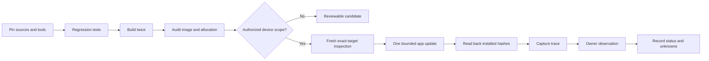

<p align="center"></p>

# NAMI iPod Lab Skill

**让 Agent 接手 iPod nano 7G 应用工程：可调用、可验证、可追溯。**

Character players · Arcade demos · Input diagnosis · Checked app updates

Version **0.2.0** adds a bundle doctor, two manifest profiles, actual HRL1 checks,
regression tests and a new-agent handoff. Python helpers need only Python 3.10+
and its standard library. No device is accessed by validation.

This Codex-compatible Skill teaches an agent how to inspect, build, diagnose,
update, verify, and document a NanoApps-style application while respecting the
line between a host test and evidence from a real device.

它整理了 NAMI 项目在真机迭代中形成的方法：精确识别设备、离线复现构建、
二进制审计、受控应用更新、USB 只读日志、安装后回读、故障停止条件，以及
`CONFIRMED / OBSERVED / INFERRED / UNKNOWN / FAILED` 五级证据表达。

> This repository contains an agent workflow, documentation, and an offline
> manifest checker. It contains no firmware, exploit payload, device dump,
> proprietary character asset, private log, recovery archive, or Soul data.

## Why this exists

Small-device work fails when “compiled,” “installed,” “appeared once,” and
“works reliably” are treated as the same fact. This Skill keeps them separate.



## What another Agent can do

- investigate a missing icon or reboot without blindly reinstalling;
- build and audit a bounded character-app candidate offline;
- stop touch, button, or motion noise from restarting animations;
- capture a volatile resident trace without calling it persistent memory;
- improve animation work or spatial resolution without hiding frame loss;
- prepare a controlled app-only update with exact readback;
- publish honest hardware evidence and a resumable experiment record.

## Install and invoke

Clone this repository directly into your Codex skills directory. These commands
honor a custom CODEX_HOME; do not clone over an existing installation:

```powershell
$codexRoot = if ($env:CODEX_HOME) { $env:CODEX_HOME } else { "$env:USERPROFILE/.codex" }
$skillDir = Join-Path $codexRoot 'skills/nami-ipod-lab'
git clone https://github.com/81823650800wzy-sketch/nami-ipod-lab-skill.git $skillDir
python "$skillDir/scripts/doctor.py"
```

Restart or refresh Codex, then invoke it:

```text
Use $nami-ipod-lab to diagnose why my NanoApps character animation restarts.
```

Automatic discovery remains enabled. More examples:

```text
Use $nami-ipod-lab to prepare a device-free candidate and evidence manifest.
Use $nami-ipod-lab to review this launch reboot without touching the device.
Use $nami-ipod-lab to design a read-only resident trace experiment.
Use $nami-ipod-lab to turn these test results into honest hardware evidence.
```

If the skill does not appear, verify `<skillDir>/SKILL.md` exists directly in
that folder, run doctor, then restart/refresh the Codex session. A nested
`nami-ipod-lab/nami-ipod-lab/SKILL.md` is the wrong installation layout.
An existing session may still require explicit reading of the absolute SKILL.md
path. The doctor checks the bundle, not the live Codex catalog.

For an existing **clean Git installation**, use `git -C $skillDir pull --ff-only`.
Review local changes before updating; never reset them automatically.

### What is included — and what the project supplies

Included: agent instructions, reference routes, offline validators and tests.
The target project supplies its Nano HAL, build/audit/emulation adapters, pinned
upstream/toolchain, device inspection and reviewed update procedure. Installing
this Skill does not install NanoApps or grant device-write authorization.

## Skill map

| Resource | Purpose |
|---|---|
| `SKILL.md` | Routing, invariants, stop conditions, output contract |
| `references/safety-and-evidence.md` | Device actions and hardware claims |
| `references/workflows.md` | Inspection, build, package, update, trace, acceptance |
| `references/troubleshooting.md` | Reboot, missing icon, short trace, stutter, noise, pixelation |
| `references/publishing.md` | Public documentation and claim discipline |
| `references/agent-handoff.md` | Fresh-machine setup, project adapter map and resume context |
| `references/manifest-validation.md` | Accepted manifest shapes and actual-blob verification |
| `scripts/validate_evidence.py` | Offline build-manifest consistency check |
| `scripts/doctor.py` | Bundle, reference links, Python syntax and UI entry checks |
| `scripts/test_validate_evidence.py` | Synthetic compatibility and corruption regressions |

## Validate

```powershell
python "$skillDir/scripts/doctor.py"
python "$skillDir/scripts/test_validate_evidence.py"
python "$skillDir/scripts/validate_evidence.py" ./build-manifest.json --blob ./NAMI.hbapp
```

The helper checks manifest consistency only. It cannot prove source integrity,
device identity, authorization, installation, performance, or safety.

The validator accepts both motion-player `outputs` manifests and arcade
`package` manifests. The optional `--blob` checks the actual hash/header and
relocation bounds. Missing or malformed fields produce JSON FAILED and exit 1.
See [manifest validation](references/manifest-validation.md) for exact limits.

## Safety boundary

The Skill requires fresh target resolution and separate authorization for
firmware, DFU, bootloader, partition, raw-disk, uncertain-write, destructive
repair, Windows driver, or Soul-restore work. It never turns a prior app-update
permission into blanket hardware authority.

Drive letters, `/dev/sdX` nodes, USB bus IDs, and product names are temporary
observations. A real workflow binds multiple independent facts, preserves a
recovery artifact, bounds operation counts, and stops on mismatch.

## Evidence, not mythology

The method came from a NAMI prototype that reached real iPod display, touch,
buttons, animation, motion sampling, a local event screen, and resident trace
capture. These are bounded observations. Autonomous cold boot, durable on-device
Soul memory, framed bidirectional USB transport, local voice, and final character
embodiment remain separate gates until direct evidence exists.

October 1: a small native three-game collection (ORBIT, BRICKS and visual BEAT)
passed offline tests and installed-file readback; the owner reported normal
application launch (**OBSERVED**). Individual controls and endurance remain
**UNKNOWN**. These results belong to that prototype, not to every device using
this Skill. Rhythm audio and permanent reboot registration are not shipped.

The workflow builds on the MIT-licensed
[NanoApps project pinned at `80d439d`](https://github.com/nfzerox/NanoApps/tree/80d439da4d9a7236501f4c23c188f226ad4a1ad2).
Source availability does not prove compatibility with a particular iPod revision
or firmware.

## License

The Skill's original instructions, helper, and artwork use the MIT License.
Third-party projects and assets retain their own licenses.
